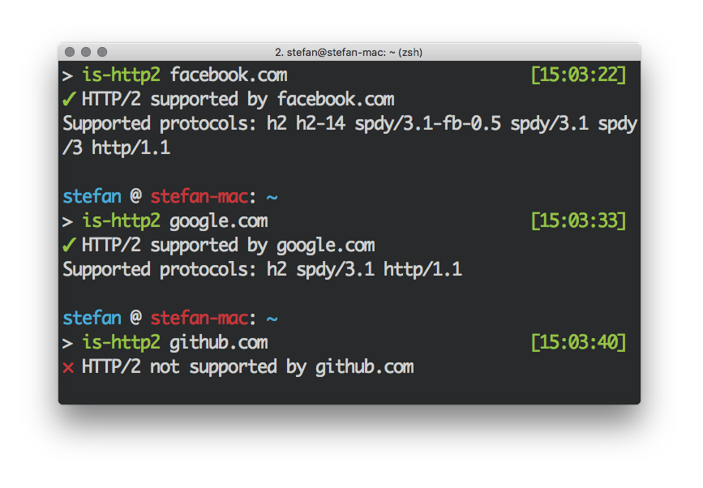

[](https://travis-ci.org/stefanjudis/is-http2-cli) [](https://www.npmjs.org/package/is-http2-cli) [](https://www.npmjs.org/package/is-http2-cli) [](https://coveralls.io/r/stefanjudis/is-http2-cli?branch=master) [](http://greenkeeper.io/)

# is-http2-cli
> Find out which hosts already support HTTP/2



This is the CLI version of [is-http2](https://github.com/stefanjudis/is-http2).

## Install

```
npm install -g is-http2-cli
```

## Basic usage

```
Usage
  $ is-http2 <host>

Options
  -s, --include-spdy  Consider SPDY protocol as HTTP/2 supporting

Examples
  $ is-http2 twitter.com
  $ is-http2 facebook.com -s
```

***************

#### I want to thank all these [people](./THANKS.md) for their great work!!!
